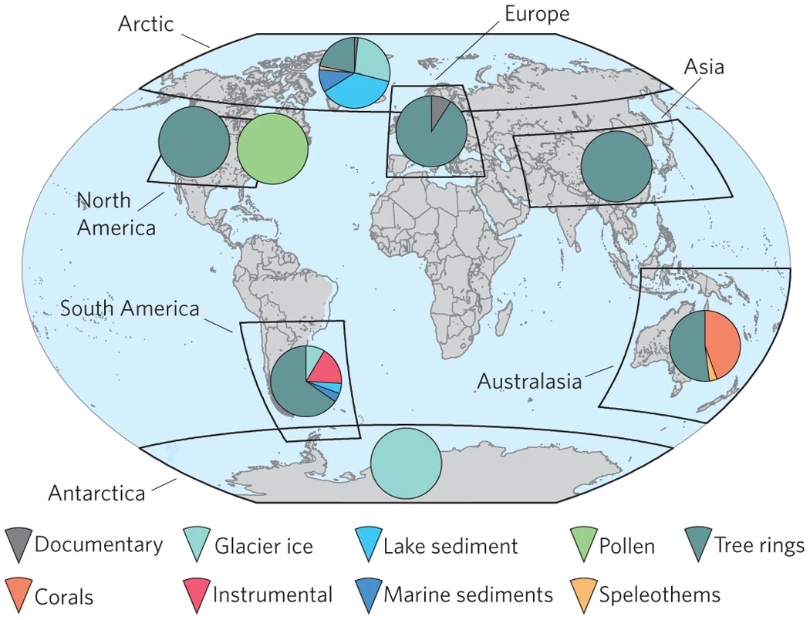

<!--more-->
# PAGES2k Network Global Temperature Proxy Database Version 1.0 (2013)


 
Access publication  &nbsp; 
Access data (WDS Paleo)   
 

Note: This is not the most recent version of the PAGES2k Network Global Temperature Proxy Database, for the current version, see Version 2 (2017).

**Citation details**
- PAGES 2k Network. 2013. PAGES (Past Global Changes) 2K Network. WDC NOAA Product.
- PAGES 2k Consortium. 2013. Continental-scale temperature variability during the past two millennia. Nature Geoscience, Vol. 6, pp. 339-346, May 2013. www.nature.com/naturegeoscience DOI: 10.1038/NGEO1797.

## Summary of Database:
The PAGES 2K network aimed to create a global synthesis of climate variability over the Common Era. This database is the 1st version of a collaboration between 9 regional working groups (WG), covering 8 continental areas, and establishes a benchmark database of climate proxies over the Common Era. Each group collated relevant timeseries and records from a variety of archives, to establish a continental-scale temperature reconstruction of the past 2000 years. Full code is provided to reproduce each of the reconstructions completed by each WG, as well as alternative reconstructions and the individual proxy records used.

### Summary of the datasets within the database: 
The database is made up of 511 timeseries, from a variety of archives including tree rings, pollen, corals, lake and marine sediments, glacier ice, speleothems, and historical documents. Outside of North America, all datasets have an annual resolution, the North american region includes tree ring and pollen reconstructions with 10 and 30-year resolutions respectively. The continental groups, shown in Table.1 below, used different statistical methods to account for nuances in their individual proxy records and calibration targets. More information on these as well as alternative reconstructions can be found in the supplementary of the accompanying publication [(PAGES2K consortium, 2013)](https://www.nature.com/articles/ngeo1797#Sec13).

Table. 1: Records used in the PAGES2k Network Global Temperature Database V1.0 (2013)
|Reconstruction group | proxy types (number of records) |Time Period (AD)
|--------------|------------|------|
|Antarctica (Ant) |Glacier Ice (11)|167-2005 |
|Arctic (Arc) |  Lake sediments (19),  Glacier Ice (16), Tree Rings (13), Marine sediments (6), Documentary (1), Speleothem (1)| 1-2000 |
|Asia (Asia) | Tree Rings (229) | 800-1989 |
|Australasia (Aus) |Tree Rings (14), Corals (13), Speleothems (1) | 1001-2001 |
|Europe (Eur) |Tree Rings (10), Documentary (1) |1-2003 |
|North America Pollen (NAmPOL) |Pollen (4 eco-regions)| 480-1950 |
|North America Tree Ring (NAmTR) |Tree Rings (146) | 1204-1947|
|South America (SAm)|Tree Rings (15), Instrumental (4), Glacier Ice (2), Lake Sediment (1), Marine Sediment (1)| 857-1995 |

### Summary of Metadata:
Metadata was included for individual proxies across all regions, including Africa records that could not be combined into a regional reconstruction. Metadata included location data, archive type and proxy measurement, relationship to temperature sign, timerange, original publication, and a PAGES_ID for future cross referencing with other PAGES products. Location data was queriable by PAGES2k region and country. A table of all metadata can be downloaded via the NOAA study page site. 

## How to access database:
The study page for the PAGES2k network WDS NOAA product contains information about the global temperature database, and can be used to access the data landing page. This can be accessed via the button below, or at the top of the page. The data landing page contains the following files for download:

* xlsx file "DatabaseS1-All-proxy-records.xlsx", containing all individual records and accompanying metadata.
* xlsx file "DatabaseS2-Regional-Temperature-Reconstructions.xlsx",containing regional reconstructions, composites, 30year averages, and other alternative reconstructions from the publication. 
* a subdirectory containing auxiliary information and text versions of database S1 and S2


 
Access data (WDS Paleo)   
 

## Want to get involved with PAGES2k network?
This Database is finalised, for more information on the PAGES2k network, find information on the working groups and projects, contact the project leaders, or join the mailing list, see the [PAGES2k Network main page](https://pastglobalchanges.org/science/wg/2k-network/projects).
