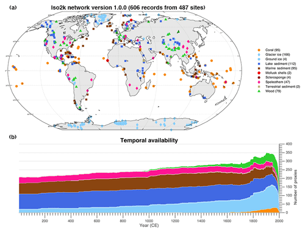

# Iso2k Global paleo Water Isotope Database
 

 
Access publication  &nbsp; 
Access data (Figshare)   &nbsp; 
Access data (LiPDVerse)  
 

**Citation Details** Konecky, B. L., McKay, N. P., Churakova (Sidorova), O. V., Comas-Bru, L., Dassié, E. P., DeLong, K. L., Falster, G. M., Fischer, M. J., Jones, M. D., Jonkers, L., Kaufman, D. S., Leduc, G., Managave, S. R., Martrat, B., Opel, T., Orsi, A. J., Partin, J. W., Sayani, H. R., Thomas, E. K., Thompson, D. M., Tyler, J. J., Abram, N. J., Atwood, A. R., Cartapanis, O., Conroy, J. L., Curran, M. A., Dee, S. G., Deininger, M., Divine, D. V., Kern, Z., Porter, T. J., Stevenson, S. L., von Gunten, L., and Iso2k Project Members: The Iso2k database: a global compilation of paleo-δ18O and δ2H records to aid understanding of Common Era climate, Earth Syst. Sci. Data, 12, 2261–2288, https://doi.org/10.5194/essd-12-2261-2020, 2020.

## Summary of Database 
The Iso2k global water isotope database compiles previously published stable oxygen (δ18O) and hydrogen (δD) paleo-records from different archives over the Common Era. These records can be used to investigate hydroclimate changes over the past 2000 years. Version 1.0.0 currently includes 759 isotope records from both terrestrial and marine sources, and is described in detail  by Konecky et al., (2020). A summary table (Table. 1) of the database is shown below, and the spatial and temporal variability of the database can be seen in Fig.A below

Table. 1: Record archival types used in the Iso2k database.
|Archive Type|Number of Records|
|----|----|---|
| Glacier and ground ice|205|
|Speleothems|68|
| Corals, sclerosponges and mollusks|145|
|Wood| 81|
|Lake sediments and other terrestrial sediments | 158 |
| Marine sediments| 99|
|Total | 759|

Figure. A: Spatial and temporal distribution of the records used in the Iso2k database, coloured by archival type. Taken from the accompanying data descriptor publication ([Konecky., et al (2020)](https://essd.copernicus.org/articles/12/2261/2020/)).

## Summary of metadata in database: 

Metadata contained in this database was created to Standardised metadata is used following the PaCTS and LiPD framework, and contains comprehensive metadata fields. 180 total metadata fields, split into 6-8 sections, are shown in Table. 2 below. The metadata includes information about each record's isotope systematics, proxy system context, as well as details on the original authors climatic interpretation, chronological uncertainties, and analytical uncertainties. There is a uniform framework within the database that is suitable for all proxy archives. This allows for a scalable foundation for future multi-proxy databases to be built upon. Some metadata fields are query-able, and cross-link with other PAGES2k databases. More information on the database metadata can be found in [Konecky., et al (2020)](https://essd.copernicus.org/articles/12/2261/2020/)

All isotope records are assigned a unique Iso2k identifier. Iso2k identifiers contain 11 characters and digits: archive type (2 characters), year published (2 digits), first authors last name (2 characters), site name (2 characters), sample number for multiple cores from the same site(00, 01, 02 etc)), and sample letter for multiple timeseries derived from the same core (A, B, C etc). All records are also assigned a unique LiPD identifier.

Table. 2: Metadata categories included in the Iso2k Database.
|Metadata Type| Description|
|----|----|
|Entity |Provides basic information for each record, such as site location, unique ids, years, or publication DOI| 
|Paleodata| Specific information about each proxy record in more detail, such as measurement material, inferred material, archive genus/spp.|
| Isotope Interpretation | critical information about environmental variables that influence isotopic variability within each record, and the nature of that relationship|
|Climate Interpretation| represents the original author's expert judgement about the primary cliamtic controls on the isotope ratios at their study site. Includes climate variables or processes, gives critical background information. |
| Queryable and standardized |metadata fields that contain binary yes no options, crosslinks, or geographic labels allow for cross referencing and searching with other PAGES databases. |
|Chronological Control | depth-age or chronological metadata, dating information, age modelss and average temporal resolution. Stored in ChronData tables that are linked to measured data (paleoData) tables| 

## How to access database:

The Iso2k database is housed in the LiPDverse. The liPDverse flexdashboard contains:
* The Iso2kv1 database files as liPD files, with serialization for matlab, R, and python (pickle)
* A changelog to manage updates to the database and solving bugs
* A Map based html widget to look for specific data by proxy type, or location. The widget allows a specific dataset to be examined.
* Each individual dataset has a page containing options to download the data as liPd, or csv, to report an issue, metadata information, a map of the site location and an interactive timeseries graph of the paleo and chronological data.

To access the liPDverse dashboard, use the button below or at the top of the page. 


 
Access data (LiPDVerse)  
 
The Iso2k database is also stored on Figshare. This public repository contains:
* Samplecode for matlab, python, R
* Data files for the entire database in R, matlab, python serialisations.
* A .README file describing how to use the files.


 
Access data (Figshare)   

## Get involved with the Iso2k Working group:
To find out more about the Iso2k project, join the mailing list, or contact the project leaders, see the [Iso2k main page](https://pastglobalchanges.org/science/wg/2k-network/projects/iso2k/intro)
 
